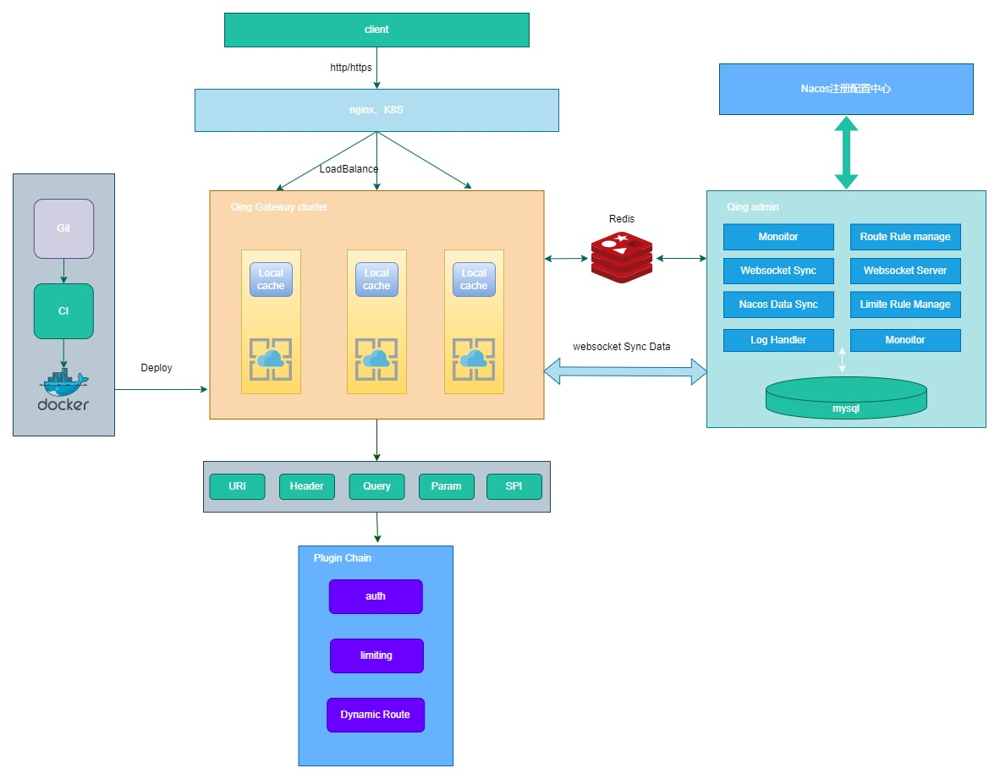
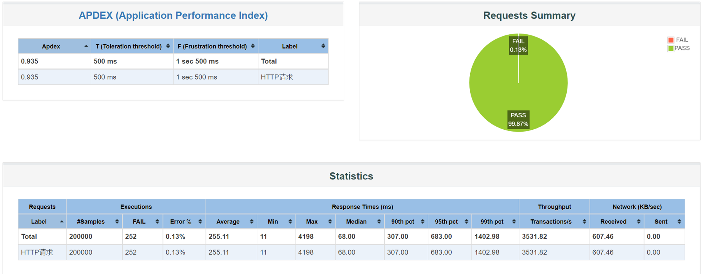
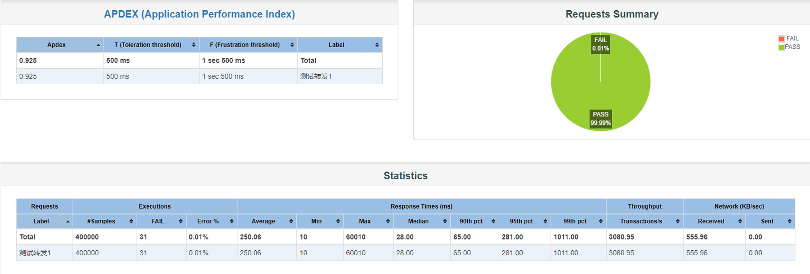

# qing-gateway

- 基于Webflux的网关服务，非阻塞IO

- 微服务注册中心选用Nacos

- 基于责任链模式+插件化思想，网关处理逻辑抽象成插件链

- 支持http、https协议

- 支持自定义路由规则

- 支持跨域

- 基于micrometer+prometheus+grafana，可观测性

  

## 一、项目结构

### 后台模块介绍：qing-gateway

- qing-server： 网关节点server
- qing-admin：网关admin管理台，可配置路由、限流、负载均衡规则、实时监控网关节点等
- qing-common：项目的公共包
- client-example-medical：微服务案例1
- client-example-traffic：微服务案例2

### 管理台前端：qing-gateway-front

## 二、项目启动

前提需安装好：Mysql、Redis

```bash
1. 在 Mysql 中新建一个库：qing_gateway。运行 qing-gateway/qing_gateway.sql 文件。
2. git clone git@github.com:conghuhu/qing-gateway.git
   cd qing_gateway
3. 修改qing-gateway/qing-admin/src/main/resources/application-dev.yml或application-prod.yml,分别对应开发环境和生     产环境，将qing-admin中的mysql和redis连接地址配好。
   修改qing-gateway/qing-server/src/main/resources/application-dev.yml或application-prod.yml，将qing-server中的    redis连接地址配好
4. 在qing-server路径下运行 mvn clean package 和 java -jar ./qing-server/target/server.jar, 网关单节点启动成功。
5. 在qing-admin路径下运行 mvn clean package 和 java -jar ./qing-admin/target/qing_admin.jar ,网关管理平台启动成功。
6. 进入qing-gateway-front,运行 yarn 和 yarn run start，启动网关管理平台前端界面。
7. 浏览器打开localhost:8080/static/index.html，看到下图登录界面，则说明成功。默认账号密码是admin,123456。
```


## 三、docker部署

1. 将qing_admin中的admin_dockerfile和其target下的qing_admin.jar放入服务器一个文件夹下，运行```docker build -f ./admin_dockerfile -t qingAdmin .```打包成image；然后运行```docker run -it -d --name qingAdmin -p 8080:8080 qingAdmin```。至此，网关管理平台已成功启动。
2. 将qing_admin中的server_dockerfile和其target下的server.jar放入服务器一个文件夹下，运行```docker build -f ./server_dockerfile -t qingServer .```打包成image；然后运行```docker run -it -d --name qingServer -p 8101:8101 qingServer```。至此，单网关节点已成功启动。如果想搭建网关集群，多台服务器重复该步骤即可，最后使用nginx对所有网关节点做反向代理。

## 四、压测资源分配

| ip              |               |        |
| --------------- | ------------- | :----- |
| 124.222.60.243  | 网关1、nacos配置中心 | 少煜服务器  |
| 101.201.143.127 | admin、redis   | 阿里云服务器 |
| 124.222.224.173 | 网关2           | 栋的服务器  |
| 150.158.97.5    | mysql8        | 青训营服务器 |
| localhost       | nginx         |        |
| 101.42.243.67   | 网关3           | 帅的服务器  |

| 服务名     | 实例        | url                  |
| ------- | --------- | -------------------- |
| traffic | example1  | 124.222.224.173:8900 |
| traffic | example12 | 124.222.224.173:8901 |
| medical | example2  | 124.222.224.173:8500 |
| traffic | example13 | 101.42.243.67:8900   |
|         |           |                      |

| 网关节点                 |      |      |
| -------------------- | ---- | ---- |
| 124.222.60.243:8080  |      |      |
| 124.222.224.173:8080 |      |      |
| 101.42.243.67:8080   |      |      |

查看网络连接情况：```netstat -n | awk '/^tcp/ {++state[$NF]} END {for(key in state) print key,"\t",state[key]}'```

### 单机压测结果

如下图所示，在4核16G的环境对网关单机测试，设置线程数为1000，2秒内发送，循环200次，也就是10w的QPS，错误率为0.13%，因此得出结论，网关单节点能承受10w的并发量。



### 集群压测结果

分别在一台4核、16G的，三台2核4G的服务器搭建四个网关节点，使用Nginx按照4，1，1，1权重做负载均衡。如下图所示，设置线程数为1000，2秒内发送，循环400次，也就是20w的QPS，错误率为0.01%。因此得出结论，集群模式下，可承受至少40w的QPS。



## 五、关键模块说明

### 可观测性


