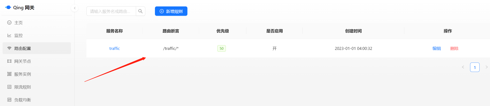
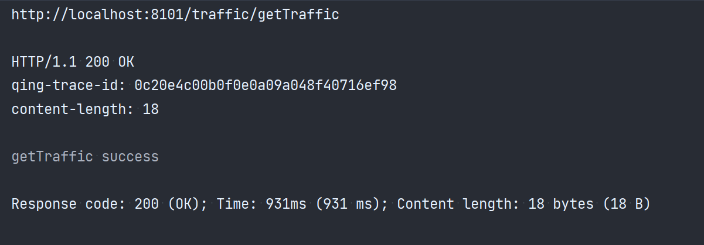
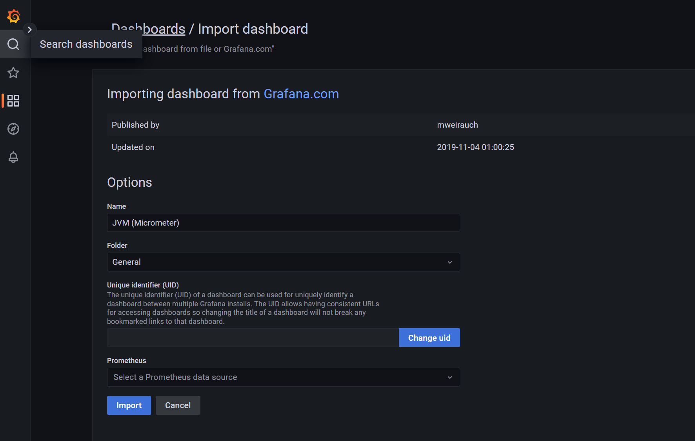
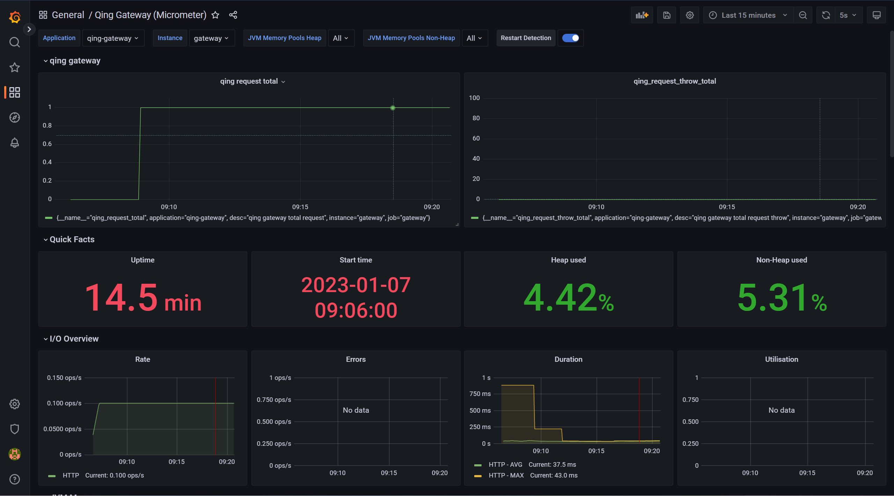
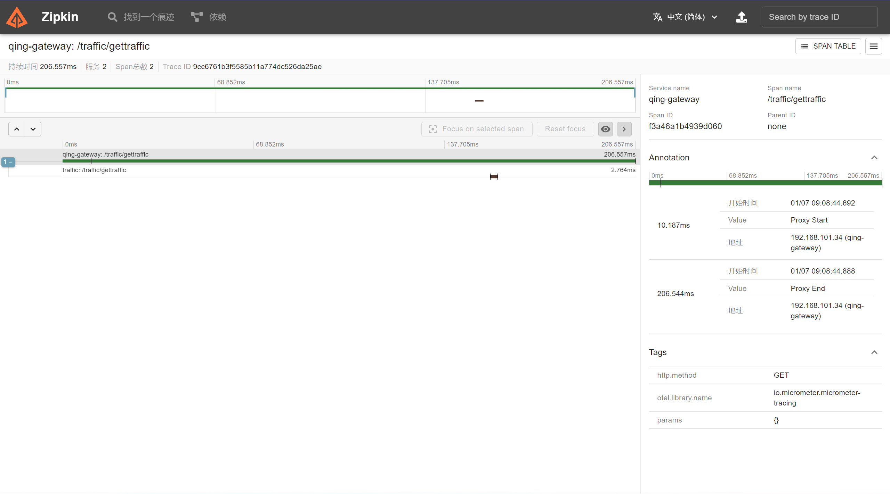

# Qing-Gateway开发文档

## 一、开发环境搭建

### Docker

### MySQL8

可使用application.yml中默认的，如果不想和别人的冲突，那就建一个自己的库，修改springboot配置文件。

### Redis

```bash
docker run -itd --name redis -p 6379:6379 redis
```

已搭建好：

- url: 47.113.189.237:6379
- password: cong0917

### Nacos

可自己搭建，也可使用application.yml中默认的，推荐开发的时候，每个人创建不同的命名空间。

### Prometheus+Grafana

本地新建`prometheus.yml`配置文件：

```yaml
global:
  scrape_interval: 10s
  evaluation_interval: 10s

scrape_configs:
  - job_name: admin
    static_configs:
      - targets: ["172.22.16.1:8081"]
        labels:
          instance: admin
    metrics_path: /actuator/prometheus
  - job_name: gateway
    static_configs:
      - targets: ["172.22.16.1:8101"]
        labels:
          instance: gateway
    metrics_path: /actuator/prometheus

```

Prometheus需修改为刚刚创建的本地配置文件的路径：

```bash
docker run -d  -p 9090:9090  -v D:/JavaLearn/prometheus/prometheus.yml:/etc/prometheus/prometheus.yml --name prometheus prom/prometheus
```

Grafana

```bash
docker run -d -p 3000:3000 --name grafana grafana/grafana-enterprise
```

### Zipkin

```bash
docker run -d -p 9411:9411 --name zipkin openzipkin/zipkin
```

### kafka+zookeeper

已搭建好：

- zookeeper：47.113.189.237:22181
- kafka: 47.113.189.237:29092

kafka连接客户端：offset explorer 2.3+

### pnpm

```bash
npm install -g pnpm
```

## 二、项目结构

### 后台模块介绍：qing-gateway

- qing-server： 网关节点server，基于Webflux
- qing-admin：网关admin管理台，可配置路由、限流、负载均衡规则、实时监控网关节点等，基于SpringBoot
- qing-common：项目的公共包
- client-example-medical：微服务案例1
- client-example-traffic：微服务案例2

### 管理台前端：qing-gateway-front

前端技术栈：React+[icejs](https://v3.ice.work/docs/guide/about)+pnpm

## 三、项目启动

### 启动前端

在前端路径下，打开终端，运行如下命令安装依赖：

```bash
pnpm install
```

运行如下命令启动本地开发：

```bash
pnpm start
```

### 启动Admin

运行`qing-gateway/client-example-traffic/src/main/java/com/example/qingclientexqmple/QingClientExqmpleApplication.java`，启动admin后台服务。

打开[http://localhost:8081/swagger-ui/index.html](http://localhost:8081/swagger-ui/index.html)查看swagger接口文档。

### 启动微服务example server

分别启动client-example-medical和client-example-traffic，这是两个微服务案例。

### 启动网关节点server

运行`qing-gateway/qing-server/src/main/java/cn/qing/server/QingServerApplication.java`，启动网关节点server。

## 四、测试

在管理台配置如下路由规则：



通过Postman或其他工具测试：

```bash
GET http://localhost:8101/traffic/getTraffic
```

看到如下的结果，恭喜你，成功跑通


以上链路为：

client --> qing-server(localhost:8101/traffic/getTraffic) --> client-example-traffic(localhost:8900/traffic/getTraffic)

client <-- qing-server(localhost:8101/traffic/getTraffic) <-- client-example-traffic(localhost:8900/traffic/getTraffic)

## 五、可观测性

### Metrics

首先Prometheus会按照配置时间定期pull qing-server和qing-admin端点的metrcis数据，然后我们需要配置grafana进行可视化展示。

打开[Grafana](http://localhost:3000/)

导入4701（MicroMeter）模板即可：





### Tracing

向网关发出对应的请求后，打开zipkin地址[http://localhost:9411/zipkin](http://localhost:9411/zipkin)查看对应链路。


